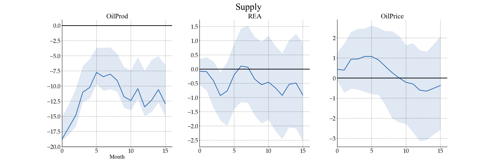
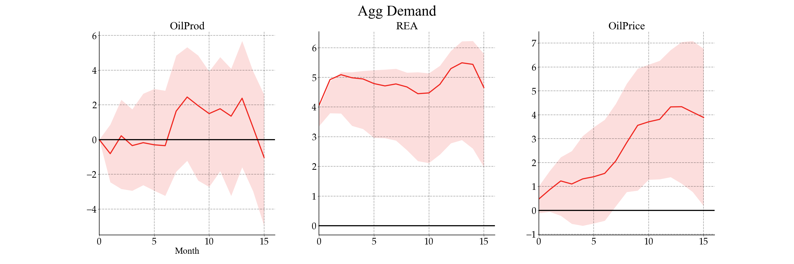
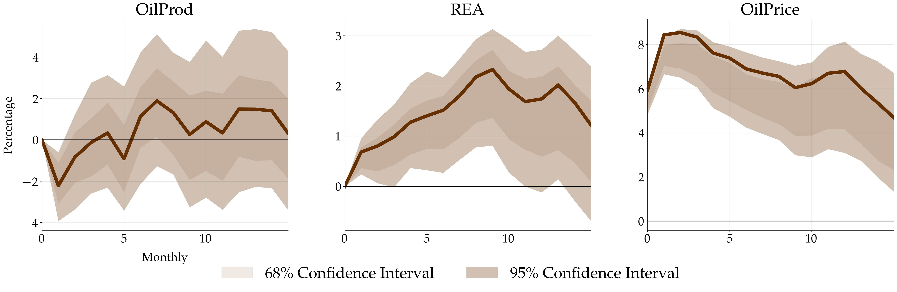

## PySVAR

This is a mini package (or just call it a bag-of-codes) designed for SVAR estimation across multiple identification schemes. I named it PySVAR, just trying to keep up with the Python package naming trend. It’s super straightforward—there will be virtually no learning curve if you're familiar with Sklearn. Simply input the parameters, and all set! 

You can find the code [here](https://github.com/fangli-DX3906/PySVAR).

### Usage
We begin with one of the simplest possible identification method: the Cholesky identification, used by Kilian in the 2009 AER paper. Assuming $e_t=A_0^{−1}\epsilon_t$, where $e_t$ represents the reduced form errors and $\epsilon_t$ denotes the structural shocks and $A_0^{-1}$ is defined as

$$
e_t=\begin{pmatrix}
e_t^{\Delta\text{prod}}\\
e_t^{\text{rea}}\\
e_t^{\text{rop}}
\end{pmatrix}=\begin{bmatrix}
a_{11} & 0 & 0\\
a_{21} & a_{22} & 0\\
a_{31} & a_{32} & a_{33}
\end{bmatrix}\begin{pmatrix}
\epsilon_t^{\text{oil supply shock}}\\
\epsilon_t^{\text{aggregate demand shock}}\\
\epsilon_t^{\text{oil specific-demand shock}}
\end{pmatrix}
$$

To model the above problem,begin by importing `RecursiveIdentification`. Next, create an agent instance, utilizing the appropriate parameters
``` python
recr = RecursiveIdentification(data=kdata, var_names=vname, shock_names=sname, date_frequency='M', lag_order=24)
```

Once the instance is initialized, invoke `.identify()` for estimation and `.bootstrap()` to calculate the confidence interval
```python
recr.identify()
recr.bootstrap(seed=3906)
```

After identification, one can use `.irf()` or `.vd()` to calculate the impulse responses and variance decomposition, respectively. Similar to the approach taken by Kilian in his paper, I also calculate the cumulative response of $\Delta \text{prod}$ as follows:
```python
mdls = [recr]
for m in mdls:
    m.irf_point_estimate[0, :] = -np.cumsum(m.irf_point_estimate[0, :])
    m.irf_point_estimate[3, :] = np.cumsum(m.irf_point_estimate[3, :])
    m.irf_point_estimate[6, :] = np.cumsum(m.irf_point_estimate[6, :])
    m.irf_point_estimate[1, :] = -m.irf_point_estimate[1, :]
    m.irf_point_estimate[2, :] = -m.irf_point_estimate[2, :]
    for _ in range(m.irf_mat_full.shape[0]):
        m.irf_mat_full[_, 0, :] = -np.cumsum(m.irf_mat_full[_, 0, :])
        m.irf_mat_full[_, 3, :] = np.cumsum(m.irf_mat_full[_, 3, :])
        m.irf_mat_full[_, 6, :] = np.cumsum(m.irf_mat_full[_, 6, :])
        m.irf_mat_full[_, 1, :] = -m.irf_mat_full[_, 1, :]
        m.irf_mat_full[_, 2, :] = -m.irf_mat_full[_, 2, :]
   m.plot_irf(h=15, var_list=n, sigs=95, with_ci=True)
```

where the point estimate and confidence interval are stored in `irf_point_estimate` and `irf_mat_full`, respectively.  Lastly call `.plot_irf()` to plot the impulse response. Here is the plot:





### Version
The current beta version now includes sign restriction, recursive identification, and exclusion identification. I will continue to update the package

The next version will include optimization-based identification and identification through heteroscedasticity. It will also incorporate historical decomposition.

Future Plan: Integrate the Bayesian method.

### Disclaimer
This is a beta version. The code has not undergone extensive testing as of yet. While we hope it proves useful, we provide absolutely no guarantees, either expressed or implied, regarding its functionality or suitability for your needs.

### Thanks
I want to extend my deepest thanks to my advisor, Dr. Marco Brianti, for introducing me to this field and providing generous guidance on the SVAR model identification and estimation.

<br>
<br>

## Mini ML Projects Inventory

This is a collection of mini machine learning projects. I hand-coded all the methods from scratch without using other packages (except for SVM, as it requires a quadratic solver). The codes were based on projects from the courses ELEG815 and CISC684. Data are available upon request. It contains several classifiers for handwritten digits and ham/spam text datasets, including perceptron, neural networks, SVM, and logistics. It also contains other methods, such as Kmeans and decision tree.

You can find the code [here](https://github.com/fangli-DX3906/mini-ML-projects).
